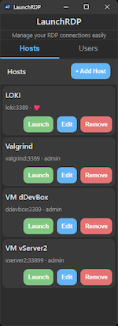

# LaunchRDP



**Modern RDP Connection Manager for Windows**

A fast, secure, and user-friendly Remote Desktop Protocol (RDP) connection manager built with Wails v2 and Go.

[](LICENSE)
[](CHANGELOG.md)
[](https://go.dev/)
[](https://wails.io/)
[](#-enterprise-deployment)

[Features](#-features) • [Installation](#-installation) • [Usage](#-usage) • [Building](#-building) • [Changelog](CHANGELOG.md)

---

## 🎯 Why LaunchRDP?

LaunchRDP is designed as a modern alternative to legacy RDP managers like mRemoteNG. It provides:

- ✅ **Native Windows Integration** - Built with Wails v2, no HTTP server overhead
- ✅ **Secure Credential Storage** - Windows Credential Manager + DPAPI encryption
- ✅ **Enterprise Ready** - NSIS installer with silent deployment for SCCM/Intune
- ✅ **Smart Window Management** - Automatic RDP window reuse, position persistence
- ✅ **Clean Modern UI** - Dark mode support, responsive design
- ✅ **Zero Configuration** - Works out of the box, no complex setup

**Perfect for:**

- IT Professionals managing multiple servers
- System administrators with frequent RDP connections
- Enterprise environments requiring automated deployment
- Organizations using SCCM, Intune, or GPO for software distribution
- Anyone tired of typing credentials repeatedly
- Users seeking a modern replacement for outdated RDP managers

---

## ✨ Features

### Connection Management

- 🖥️ **Multi-Host Support** - Store unlimited RDP connections
- 👤 **User Profiles** - Manage multiple credential sets
- 🔐 **Secure Credentials** - Native Windows Credential Manager integration
- 📝 **Custom Names** - Friendly aliases for easy identification
- 🔄 **Window Reuse** - Automatically detects and activates existing connections

### Window & Display

- 📐 **Custom Positioning** - Save window positions per connection
- 📏 **Size Presets** - Configure window dimensions for each host
- 🖼️ **Fullscreen Mode** - Toggle between windowed and fullscreen
- 🖥️ **Multi-Monitor** - Multi-monitor support in fullscreen mode

### Advanced Options

- 📋 **Clipboard Sharing** - Seamless copy/paste between local and remote
- 💾 **Drive Mapping** - Share local drives with remote sessions
- 🔌 **Custom Ports** - Configure non-standard RDP ports
- ⚙️ **Per-Connection Settings** - Individual configuration for each host

### Security & Privacy

- 🔒 **DPAPI Encryption** - Windows Data Protection API for stored passwords
- 🛡️ **Native Credential Storage** - Leverages Windows Credential Manager
- � **No Cloud Sync** - All data stays on your local machine
- 🔐 **Domain Support** - Full support for domain credentials

### Enterprise & Deployment

- 📦 **NSIS Installer** - Professional Windows installer package
- 🤖 **Silent Install** - Unattended deployment with `/S` parameter
- 🏢 **SCCM/Intune Ready** - Enterprise deployment compatible
- 🗑️ **Multi-User Cleanup** - Optional user data removal during uninstall
- 📋 **Desktop Shortcut** - Optional shortcut creation during setup

---

## 📋 Requirements

- **OS**: Windows 10/11 (64-bit)
- **Runtime**: WebView2 (usually pre-installed on Windows 10+)
- **Disk Space**: ~10 MB

> **Note**: WebView2 is automatically installed on Windows 11 and recent Windows 10 updates. If needed, it will download automatically on first launch.

---

## 🚀 Installation

### Option 1: NSIS Installer (Recommended)

1. Download the latest `LaunchRDP-x.x.x-Installer.exe` from [Releases](https://github.com/chrilep/LaunchRDP/releases)
2. Run the installer
   - Choose installation directory (default: `C:\Program Files\Lancer\LaunchRDP`)
   - Optionally create desktop shortcut
   - Click Install
3. Launch from Start Menu or Desktop
4. Your data will be stored in `%APPDATA%\Lancer\LaunchRDP\`

**Installer Features:**

- ✅ WebView2 runtime detection and automatic download
- ✅ Desktop shortcut option
- ✅ Start menu integration
- ✅ Clean uninstallation with optional user data removal
- ✅ ~10.3 MB installer size

### Option 2: Portable Executable

1. Download the latest `LaunchRDP.exe` from [Releases](https://github.com/chrilep/LaunchRDP/releases)
2. Run the executable - no installation needed!
3. Your data will be stored in `%APPDATA%\Lancer\LaunchRDP\`

### Option 3: Build from Source

See [Building from Source](#-building-from-source) section below.

---

## 💡 Usage

### Quick Start

1. **Launch the Application**
   - Run `LaunchRDP.exe`
   - The application window will open

2. **Add Your First User**
   - Click the **Users** tab
   - Click **Add User**
   - Enter username, login, domain (optional), and password
   - Click **OK**

3. **Add Your First Host**
   - Click the **Hosts** tab
   - Click **Add Host**
   - Enter custom name (optional) and host address/IP
   - Select the user credentials to use
   - Configure window settings if needed
   - Click **OK**

4. **Connect**
   - Click the **Launch** button next to any host
   - LaunchRDP will automatically use stored credentials
   - Window position and size will be restored if previously saved

### Interface Overview

```
┌─────────────────────────────────────┐
│         LaunchRDP                   │  ← Header
├─────────────┬───────────────────────┤
│   Hosts   │   Users   │            │  ← Navigation Tabs
├───────────────────────────────────┬─┤
│                                   │E│
│  🖥️ Production Server            │d│  ← Host List
│     192.168.1.10:3389            │i│
│     [Edit] [Launch]              │t│
│                                   │ │
│  🖥️ Test Environment             │H│  ← Edit Panel
│     test.domain.local            │o│     (shows when editing)
│     [Edit] [Launch]              │s│
│                                   │t│
└───────────────────────────────────┴─┘
```

### Tips & Tricks

- **Quick Launch**: Double-click a host to launch immediately
- **Window Reuse**: LaunchRDP automatically detects existing RDP windows and brings them to front instead of creating duplicates
- **Edit Shortcuts**: Click a host name to quickly edit its settings
- **Domain Credentials**: Use `DOMAIN\username` format in the login field
- **Password Update**: Leave password empty when editing users to keep existing password

---

## 🏢 Enterprise Deployment

LaunchRDP is designed for enterprise environments with full support for automated deployment.

### Silent Installation

For unattended deployment via SCCM, Intune, or GPO:

```powershell
# Silent install to default location
LaunchRDP-Installer.exe /S

# Silent install to custom location
LaunchRDP-Installer.exe /S /D=C:\CustomPath\LaunchRDP
```

**Silent Install Behavior:**

- No user interaction required
- Installs to `C:\Program Files\Lancer\LaunchRDP` (or custom path)
- No desktop shortcut created (can be deployed separately via GPO)
- WebView2 automatically downloaded if missing
- Returns exit code 0 on success

### SCCM/Intune Deployment Package

**Detection Method:**

- File: `C:\Program Files\Lancer\LaunchRDP\LaunchRDP.exe`
- Product Version: `2.0.1` (or later)

**Install Command:**

```
LaunchRDP-Installer.exe /S
```

**Uninstall Command:**

```
"C:\Program Files\Lancer\LaunchRDP\uninstall.exe" /S
```

**Requirements:**

- Windows 10/11 (64-bit)
- WebView2 Runtime (auto-installs if missing)
- ~10 MB disk space

### Group Policy Deployment

1. Copy installer to network share: `\\server\share\software\LaunchRDP-Installer.exe`
2. Create GPO: Computer Configuration → Policies → Software Settings → Software Installation
3. Add new package, select installer
4. Configure deployment options (assigned/published)
5. Apply to target OUs

### Multi-User Environments

LaunchRDP stores user data in `%APPDATA%\Lancer\LaunchRDP\`, ensuring:

- ✅ Per-user configurations and credentials
- ✅ No administrator rights required for normal operation
- ✅ Credentials isolated between Windows users
- ✅ Clean uninstall with optional user data removal

---

## 🛠️ Building from Source

### Prerequisites

- [Go 1.21+](https://go.dev/dl/)
- [Node.js 16+](https://nodejs.org/)
- [Wails CLI v2](https://wails.io/docs/gettingstarted/installation)

```powershell
# Install Wails CLI
go install github.com/wailsapp/wails/v2/cmd/wails@latest
```

### Build Steps

```powershell
# Clone the repository
git clone https://github.com/chrilep/LaunchRDP.git
cd LaunchRDP

# Build with the provided script (creates NSIS installer)
.\build.ps1

# Or build manually
wails build -nsis
```

The outputs will be created in `build/bin/`:

- `LaunchRDP.exe` - Portable executable
- `LaunchRDP x.x.x Installer.exe` - NSIS installer package

### Development Mode

```powershell
# Run in development mode with hot reload
.\build.ps1 dev

# Or manually
wails dev
```

For detailed build instructions, see [BUILD.md](BUILD.md)

---

## 📁 Project Structure

```
LaunchRDP/
├── app/                    # Backend Go code
│   ├── config/            # Configuration management
│   ├── credentials/       # Windows Credential Manager integration
│   ├── logging/           # Logging utilities
│   ├── models/            # Data models
│   ├── rdp/               # RDP file generation and launching
│   └── storage/           # JSON file storage
├── frontend/              # Frontend code
│   ├── src/              # JavaScript source
│   ├── index.html        # Main UI
│   └── style.css         # Styling
├── build/                # Build outputs
│   ├── bin/              # Compiled executables and installer
│   └── windows/          # Windows-specific build resources
│       └── installer/    # NSIS installer configuration
├── res/                  # Resources (icons)
├── app.go               # Main application logic
├── main.go              # Entry point
├── version.go           # Version information (single source of truth)
├── wails.json           # Wails configuration
└── build.ps1            # Automated build script with version management
```

---

## 🔧 Configuration

LaunchRDP stores all data locally:

- **Application Data**: `%APPDATA%\Lancer\LaunchRDP\`
  - `hosts.json` - Host configurations
  - `users.json` - User credentials (DPAPI encrypted)
  - `window_state.json` - Window position and size

- **Credentials**: Windows Credential Manager
  - Target: `TERMSRV/{hostname}`
  - Automatically managed by the application

- **Logs & Temp Files**: `%LOCALAPPDATA%\Lancer\LaunchRDP\`
  - Log files
  - Temporary RDP files

---

## 🆙 Upgrading from v1.x

### What Changed in v2.0

- ✅ Migrated from HTTP server to native Wails v2 application
- ✅ Improved security with native Credential Manager API
- ✅ Added RDP window reuse functionality
- ✅ Removed all popup notifications for cleaner UX
- ✅ Complete English localization
- ✅ Professional NSIS installer with enterprise deployment support
- ✅ Credentials written to Windows Credential Manager on launch (not on edit)

### Migration Steps

1. Backup your data: `%APPDATA%\Lancer\LaunchRDP\`
2. Install LaunchRDP v2.0.0
3. Launch the application - data migrates automatically
4. Verify all hosts and credentials

See [CHANGELOG.md](CHANGELOG.md) for detailed changes.

---

## 🤝 Contributing

Contributions are welcome! Please feel free to submit issues and pull requests.

### Development Workflow

1. Fork the repository
2. Create a feature branch (`git checkout -b feature/amazing-feature`)
3. Commit your changes (`git commit -m 'Add amazing feature'`)
4. Push to the branch (`git push origin feature/amazing-feature`)
5. Open a Pull Request

### Reporting Issues

Found a bug? Have a feature request? Please [open an issue](https://github.com/chrilep/LaunchRDP/issues).

---

## 📝 License

This project is licensed under the MIT License - see the [LICENSE](LICENSE) file for details.

---

## 🙏 Acknowledgments

- Built with [Wails](https://wails.io/) - Go + Web frontend framework
- Inspired by mRemoteNG and other RDP managers
- Thanks to the Go and Wails communities

---

## 📧 Support

- **Issues**: [GitHub Issues](https://github.com/chrilep/LaunchRDP/issues)
- **Discussions**: [GitHub Discussions](https://github.com/chrilep/LaunchRDP/discussions)
- **Changelog**: [CHANGELOG.md](CHANGELOG.md)

---

<div align="center">

**⭐ If you find LaunchRDP useful, please consider giving it a star! ⭐**

Made with ❤️ by [Lancer](https://github.com/chrilep)

</div>
